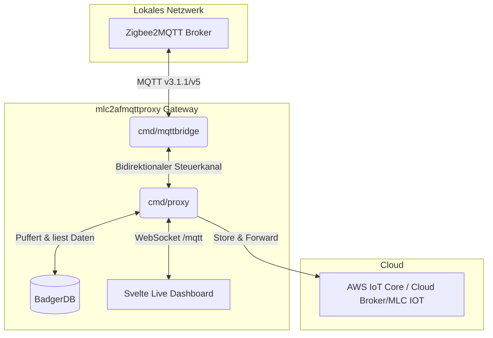

# MLC Edge Proxy


[🇬🇧 Read this in English](README_en.md)
Ein  Edge-Proxy für IoT-Sensoren (z.B. Zigbee2MQTT), der auf unzuverlässigen Verbindungen (z.B. Edge-Gateways mit Mobilfunk/schlechtem WLAN) für eine verlustfreie Telemetrie-Übertragung in die Cloud sorgt.

## Was macht der Proxy?
Der **MLC Edge Proxy** ist ein leichtgewichtiger, in Go geschriebener lokaler MQTT-Broker (basierend auf Mochi-MQTT), der eine "Store-and-Forward"-Architektur implementiert. Er ist speziell dafür konzipiert, auf Edge-Geräten (z.B. einem lokalen Raspberry Pi, der Zigbee2MQTT hostet) zu laufen. Der Proxy fängt diese Daten ab und schreibt sie lokal und extrem schnell in eine lokale Datenbank auf die Festplatte. Ein unabhängiger Hintergrund-Worker versucht anschließend, diese Daten an die Cloud weiterzuleiten.

### Warum überhaupt Zigbee Sensoren nutzen?
Besonders im industriellen IoT- oder Edge-Umfeld bieten Zigbee-Sensoren enorme Vorteile:
1. **Low Power & Batteriebetrieben:** Zigbee-Geräte verbrauchen extrem wenig Strom. Ein kleiner Sensor (z.B. für Temperatur oder Luftfeuchtigkeit) kann mit einer einzigen Knopfzelle oft **mehrere Jahre** ohne Batteriewechsel betrieben werden.
2. **Mesh-Netzwerk:** Zigbee baut ein sich selbst heilendes Mesh-Netzwerk auf. Jedes an den Strom angeschlossene Zigbee-Gerät (z.B. eine smarte Steckdose oder ein Repeater) leitet das Signal anderer Sensoren automatisch weiter, wodurch riesige Reichweiten und eine hohe Ausfallsicherheit selbst in verwinkelten Gebäuden erreicht werden.
3. **Kosten & Vielfalt:** Es gibt eine riesige Auswahl an extrem günstigen und zuverlässigen Sensoren unterschiedlichster Hersteller, die dank *Zigbee2MQTT* alle nahtlos herstellerübergreifend zusammenarbeiten.

> [!IMPORTANT]
> **Der Hauptvorteil dieser Lösung:** Es können keine Daten verloren gehen, selbst bei einem kompletten Internet- oder Netzwerkausfall. Voraussetzung dafür ist lediglich, dass dieser Proxy und die Datenquelle (z.B. Zigbee2MQTT) auf dem gleichen Server laufen, der durch eine USV (Unterbrechungsfreie Stromversorgung) abgesichert ist. Da der Proxy extrem ressourcenschonend ist, reicht hierfür bereits ein sehr kleiner Rechner wie ein Raspberry Pi völlig aus. Kommt das Internet zurück, werden alle zwischengespeicherten Daten mit den korrekten historischen Zeitstempeln an die Cloud übertragen.

## Warum diesen Proxy nutzen?

Ob du IoT-Daten zentral in die Cloud funkst oder an ein lokales Smart-Home-System anbindest – dieser Proxy löst für dich gleich mehrere architektonische Kernprobleme am Netzwerk-Edge:

1. **Zero Data Loss (Store & Forward):**
   Das Internet oder das Heim-WLAN fällt aus? Kein Problem. Der Proxy speichert alle Sensor-Daten lokal in einer rasend schnellen Datenbank zwischen. Sobald die Verbindung wieder steht, werden alle Daten lückenlos nachgereicht.
2. **Bandbreiten-Reduktion & Cloud-Entlastung:**
   Viele Sensoren (z.B. Stromzähler) senden im Sekundentakt exakt denselben Wert. Die *Intelligente JSON Deduplizierung* verwirft redundante Daten lokal am Edge, bevor sie das Netzwerk überhaupt belasten. Das spart nicht nur Gigabytes an mobilem Datenvolumen, sondern entlastet auch die Datenbank deines Backends massiv.
3. **Perfekt für Home Assistant & Cloud:**
   Durch die Time-Travel-Funktion (`timestamp_mode`) werden die exakten historischen Zeitstempel beim Senden nachgereicht. Backend-Systeme oder *Home Assistant* Instanzen können den Sensor-Wert somit zur echten, ursprünglichen Zeit eintragen, statt nach einem langen Offline-Zeitraum plötzlich tausende Werte mit einem falschen, aktuellen Zeitstempel zu protokollieren.
4. **Schutz vor "Poison Messages":**
   Cloud-Broker (und gelegentlich auch lokale Broker) weisen manchmal ungültige Topics oder Payloads ab. Anstatt in einer Netzwerk-Endlosschleife zu verenden, erkennt der Proxy dies anhand von MQTT 5 Reason Codes und wirft die defekte Nachricht präventiv aus der Queue, damit der restliche Datenstrom ungehindert weiterfließen kann.

### Kern-Features
*   **Effizienz:** Nutzt eine eingebettete Datenbank für extrem schnelles, lokales Caching.
*   **Ausfallsicherheit:** Der Proxy springt ein, wenn der Master-Broker offline ist.
*   **Live Dashboard:** Integrierter, reaktiver MQTT Tree Explorer (Websocket-basiert, Svelte) auf Port `8097`.
*   **Mochi-MQTT Broker:** Eingebetteter, ressourcenschonender MQTT Broker für lokale Geräte.
*   **Protokoll-Support:** Voller Support für MQTT v3.1.1, MQTT v4 und **MQTT v5**.
  * **Ausgehend (Upstream & Bridge)**: Verwendet je nach Konfiguration MQTT v3.1.1 oder nativ **MQTT v5**, um moderne Features wie User Properties nutzen zu können.
* **Offline Catch-Up (Time-Travel)**: Die exakten historischen Zeitstempel (`ts`) des Sensor-Ereignisses werden bei der Übertragung nachgereicht. So entstehen keine verfälschten Graphen, wenn das Internet wiederkehrt.
* **Intelligente JSON Deduplizierung (Debouncing):** Verhindert das Fluten des Netzwerks durch "nervöse" Sensoren. Filtern identischer Nachrichten in einem konfigurierbaren Zeitfenster. Optionale Ignore-Listen (`deduplicate_ignore_keys`) erlauben es, irrelevante Keys (z.B. `last_seen`, `linkquality`) vor dem Vergleich zu ignorieren.
* **Poison Message Protection:** Der Worker erkennt automatisch "giftige" Nachrichten (z.B. Publish-Versuche auf Wildcard-Topics wie `+/#` oder Server `Reason Codes != 0`) und entfernt diese gezielt aus der lokalen Datenbank. Dies verhindert permanente Endlosschleifen (Head-of-Line Blocking) und garantiert einen flüssigen Datenstrom.
* **Topic Aliases (MQTT 5):** Reduziert den Bandbreitenverbrauch drastisch, indem lange Topic-Strings (z.B. `zigbee2mqtt/0xf074bffffe91bd75`) nach dem ersten Senden durch einen simplen Integer-Alias ersetzt werden. Der Proxy erkennt Upstream-Server-Restarts automatisch und synchronisiert die Aliases sicher neu.
* **Zwei Upstream-Modi**: 
  * `http`: Mappt flaches Zigbee-JSON direkt auf das strukturierte MLC Sensor Monitor Format (`POST /api/v1/ingest`).
  * `mqtt`: Leitet MQTT-Nachrichten mit `QoS 1` an einen vorgeschalteten Cloud-Broker weiter. Da MQTT v3.1.1 standardmäßig keine Zeitstempel-Metadaten unterstützt, bietet der Proxy drei konfigurierbare `timestamp_mode` Optionen:
    * `none`: Standard-Verhalten (Kein Zeitstempel).
    * `json_inject`: Entpackt JSON-Payloads und injiziert den Zeitstempel (Unix ms) standardmäßig als `_ts` Attribut ("inject if absent" - existierende Felder werden nie überschrieben!). 
    * `v5_property`: Nutzt **MQTT v5** und sendet den Zeitstempel extrem effizient und sauber als "User Property" (`ts`) im MQTT Header. Das JSON Payload bleibt dadurch zu 100% im Originalzustand.
  
  > [!TIP]
  > **Hinweis zu Zeitstempeln & Zigbee2MQTT:** Wenn du nicht unser eigenes MLC-Backend nutzt, solltest du in Zigbee2MQTT die Option `last_seen` (als `epoch`) aktivieren. Du kannst dann in der Proxy-Konfiguration das `timestamp_field` auf `last_seen` stellen. Der Proxy agiert dann als sauberes Polyfill und fügt die Empfangszeit nur ein, falls Zigbee2MQTT noch keinen Wert gesendet hat.

  * **Topic Rewrite:** Optional kann beim MQTT-Forwarding ein empfangener Topic-Präfix (`match_prefix`) durch einen anderen (`replace_with`) ersetzt werden (z.B. von `zigbee2mqtt/` auf `/v1/bridgedataxxx/`).
* **Downstream Routing (Cloud → Lokal):** Nachrichten vom Upstream-Broker können an lokale MQTT-Clients weitergeleitet werden (z.B. zum Schalten von Aktoren von der Cloud). Loop-Detection via `origin`-Property verhindert Endlosschleifen. Siehe `mqtt.downstream_config` in der Konfiguration.
* **Health & Diagnostik**: Eingebautes Web-Dashboard (Port `8097`) zeigt den Live-Pufferstand und Status-Informationen an (`/api/v1/health` liefert die Version).
* **Ausfallsicher**: Out-of-the-Box Systemd-Deployment für Autostart nach Stromausfällen.
* **Best Practice Setup**: Eine detaillierte Übersicht für das optimale, ausfallsichere Hardware-Setup findest du unter [Best Setup & Integration](file:///mnt/data2tb/mlc2afmqttproxy/docs/best_setup.md).

## Quickstart
Das Projekt nutzt [Task](https://taskfile.dev/) für automatisierte Builds.

1. **Abhängigkeiten auflösen:** `task setup`
2. **Kompilieren:** `task build`
3. **Lokal starten:** `task run`

### Systemweite Installation (RPM / DEB)
Für den produktiven Einsatz empfehlen wir die generierten RPM- oder DEB-Pakete. Diese legen automatisch einen dedizierten User (`mlc-edge-proxy`) an, kopieren die Config nach `/etc/mlc-edge-proxy/` und richten den systemd-Service ein.

1. **Pakete bauen:** `task package`
2. **Installieren:**
   - Debian/Ubuntu/Raspberry Pi: `sudo apt install ./build/dist/mlc-edge-proxy_*.deb`
   - CentOS/RHEL/Fedora: `sudo rpm -i build/dist/mlc-edge-proxy-*.rpm`
3. **Config anpassen:** `sudo nano /etc/mlc-edge-proxy/config.yaml`
4. **Service neustarten:** `sudo systemctl restart mlc-edge-proxy`

## Architektur & Tools

Dieses Projekt besteht aus mehreren Komponenten, die eng zusammenarbeiten:



### 1. Das Live Dashboard (UI)
Der Proxy bietet auf Port `8097` ein integriertes Web-Dashboard (Svelte). Es zeigt den Puffer-Status an und bietet einen reaktiven **Live MQTT Tree Explorer**.


### 2. CLI-Tools
Zusätzlich zum Proxy beinhaltet das Projekt nützliche Hilfsprogramme in `cmd/`.

#### MQTT Bridge
Ein einfaches CLI-Tool (`bin/mqttbridge`), um für Testzwecke oder lokale Umleitungen alle Nachrichten eines "Master" MQTT-Brokers (z.B. ein lokaler Zigbee2MQTT Broker) an einen "Slave" Broker (z.B. dieser Proxy) weiterzuleiten:
```bash
./bin/mqttbridge --master tcp://localhost:1883 --slave tcp://localhost:1884 --topic "#"
```

**Bidirektionaler Modus:**
Durch das Hinzufügen des `--bidi` Flags arbeitet das Tool bidirektional (leitet auch Daten vom Slave zurück an den Master). Dabei nutzt es eine intelligente Loop-Detection, um Endlosschleifen (Echo-Loops) zu verhindern.
```bash
./bin/mqttbridge --master tcp://localhost:1883 --slave tcp://localhost:1884 --topic "#" --bidi
```
Nutze `./bin/mqttbridge --help` für weitere Optionen.

## Konfiguration
Alle Parameter und Architektur-Diagramme findest du in der [Konfigurations-Doku](docs/configuration.md).

## Versionierung
Die Version des Proxys wird beim Bauen (`task build`) automatisch aus deinen Git-Tags abgeleitet und fest in das Binary kompiliert. Sie kann jederzeit über den `GET /api/v1/health` Endpunkt abgefragt werden.

## Lizenz
Dieses Projekt steht unter der **GNU General Public License v3.0 (GPLv3)**.
Copyright (C) 2026 Michael Lechner

Durch diese Lizenz ist die Pflicht zur Namensnennung (Attribution) des ursprünglichen Autors sichergestellt. Jeder, der dieses Projekt verändert oder weiterverteilt, muss den Copyright-Hinweis beibehalten und seine Änderungen unter denselben Lizenzbedingungen (GPLv3) als Open Source zur Verfügung stellen. Siehe die Datei `LICENSE` für die vollständigen Lizenzbedingungen.

## Changelog
Alle Release-Notes und Änderungen findest du im [CHANGELOG.md](CHANGELOG.md).
