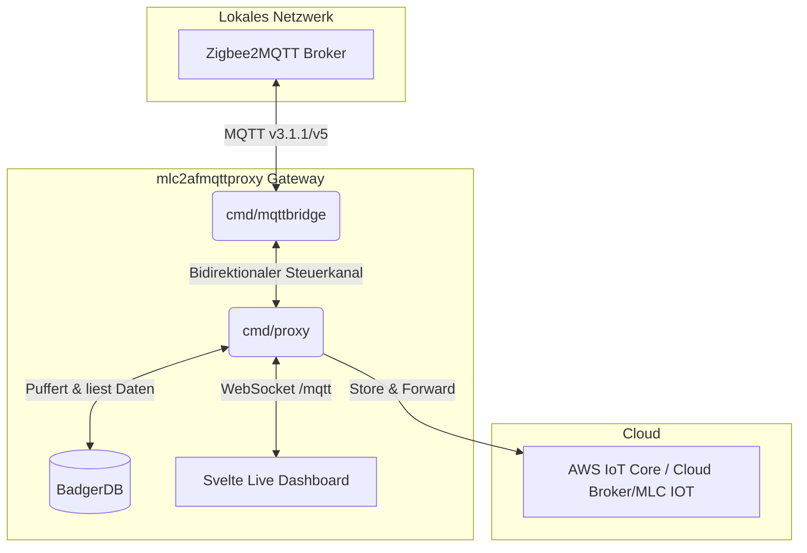

# MLC2AF MQTT Store & Forward Proxy

[🇬🇧 Read this in English](README_en.md)
Ein  Edge-Proxy für IoT-Sensoren (z.B. Zigbee2MQTT), der auf unzuverlässigen Verbindungen (z.B. Edge-Gateways mit Mobilfunk/schlechtem WLAN) für eine verlustfreie Telemetrie-Übertragung in die Cloud sorgt.

## Was macht der Proxy?
Der Proxy startet einen lokalen MQTT Broker (Mochi), an den Zigbee2MQTT (oder andere lokale Sensoren) ihre Daten senden. Der Proxy fängt diese Daten ab und schreibt sie lokal und extrem schnell auf die Festplatte (BadgerDB). Ein unabhängiger Hintergrund-Worker versucht anschließend, diese Daten an die Cloud weiterzuleiten.

> [!IMPORTANT]
> **Der Hauptvorteil dieser Lösung:** Es können keine Daten verloren gehen, selbst bei einem kompletten Internet- oder Netzwerkausfall. Voraussetzung dafür ist lediglich, dass dieser Proxy und die Datenquelle (z.B. Zigbee2MQTT) auf dem gleichen Server laufen, der durch eine USV (Unterbrechungsfreie Stromversorgung) abgesichert ist. Da der Proxy extrem ressourcenschonend ist, reicht hierfür bereits ein sehr kleiner Rechner wie ein Raspberry Pi völlig aus. Kommt das Internet zurück, werden alle zwischengespeicherten Daten mit den korrekten historischen Zeitstempeln an die Cloud übertragen.

### Kern-Features
*   **Effizienz:** Nutzt BadgerDB für extrem schnelles, lokales Caching.
*   **Ausfallsicherheit:** Der Proxy springt ein, wenn der Master-Broker offline ist.
*   **Live Dashboard:** Integrierter, reaktiver MQTT Tree Explorer (Websocket-basiert, Svelte) auf Port `8097`.
*   **Mochi-MQTT Broker:** Eingebetteter, ressourcenschonender MQTT Broker für lokale Geräte.
*   **Protokoll-Support:** Voller Support für MQTT v3.1.1, MQTT v4 und MQTT v5.n Features nutzen.
  * **Ausgehend (Upstream & Bridge)**: Verwendet bewusst **MQTT v3.1.1** für maximale Kompatibilität, da ein Großteil aller Cloud-Broker (wie AWS IoT Core) diesen Standard für die Datenübernahme (Ingestion) bevorzugt unterstützt.
* **Offline Catch-Up (Time-Travel)**: Die exakten historischen Zeitstempel (`ts`) des Sensor-Ereignisses werden bei der Übertragung nachgereicht. So entstehen keine verfälschten Graphen, wenn das Internet wiederkehrt.
* **Zwei Upstream-Modi**: 
  * `http`: Mappt flaches Zigbee-JSON direkt auf das strukturierte MLC Sensor Monitor Format (`POST /api/v1/ingest`).
  * `mqtt`: Leitet MQTT-Nachrichten mit `QoS 1` an einen vorgeschalteten Cloud-Broker weiter. Da MQTT v3.1.1 standardmäßig keine Zeitstempel-Metadaten unterstützt, bietet der Proxy drei konfigurierbare `timestamp_mode` Optionen:
    * `none`: Standard-Verhalten (Kein Zeitstempel).
    * `json_inject`: Entpackt JSON-Payloads und injiziert den Zeitstempel als `ts` Attribut.
    * `v5_property`: Nutzt MQTT v5 und sendet den Zeitstempel als "User Property" Header.
  * **Topic Rewrite:** Optional kann beim MQTT-Forwarding ein empfangener Topic-Präfix (`match_prefix`) durch einen anderen (`replace_with`) ersetzt werden (z.B. von `zigbee2mqtt/` auf `/v1/bridgedataxxx/`).
* **Health & Diagnostik**: Eingebautes Web-Dashboard (Port `8097`) zeigt den Live-Pufferstand und Status-Informationen an (`/api/v1/health` liefert die Version).
* **Ausfallsicher**: Out-of-the-Box Systemd-Deployment für Autostart nach Stromausfällen.

## Quickstart
Das Projekt nutzt [Task](https://taskfile.dev/) für automatisierte Builds.

1. **Abhängigkeiten auflösen:** `task setup`
2. **Kompilieren:** `task build`
3. **Lokal starten:** `task run`
4. **Als Hintergrunddienst (Linux) installieren:** `task install-service` (erfordert sudo)

## Architektur & Tools

Dieses Projekt besteht aus mehreren Komponenten, die eng zusammenarbeiten:



### 1. Das Live Dashboard (UI)
Der Proxy bietet auf Port `8097` ein integriertes Web-Dashboard (Svelte). Es zeigt den Puffer-Status an und bietet einen reaktiven **Live MQTT Tree Explorer**.


### 2. CLI-Tools
Zusätzlich zum Proxy beinhaltet das Projekt nützliche Hilfsprogramme in `cmd/`.

#### MQTT Bridge
Ein einfaches CLI-Tool (`bin/mqttbridge`), um für Testzwecke oder lokale Umleitungen alle Nachrichten eines "Master" MQTT-Brokers (z.B. ein lokaler Zigbee2MQTT Broker) an einen "Slave" Broker (z.B. dieser Proxy) weiterzuleiten:
```bash
./bin/mqttbridge --master tcp://localhost:1883 --slave tcp://localhost:1884 --topic "#"
```
Nutze `./bin/mqttbridge --help` für weitere Optionen.

> [!NOTE]
> **Einschränkung:** Das Forwarding ist aktuell **streng unidirektional** (Master -> Slave). Es ist mit diesem Test-Tool also _nicht_ möglich, bidirektional zu arbeiten, z.B. um über den Slave-Broker ein Licht am Master-Broker einzuschalten.

## Konfiguration
Alle Parameter und Architektur-Diagramme findest du in der [Konfigurations-Doku](docs/configuration.md).

## Versionierung
Die Version des Proxys wird beim Bauen (`task build`) automatisch aus deinen Git-Tags abgeleitet und fest in das Binary kompiliert. Sie kann jederzeit über den `GET /api/v1/health` Endpunkt abgefragt werden.

## Lizenz
Dieses Projekt steht unter der **GNU General Public License v3.0 (GPLv3)**.
Copyright (C) 2026 Michael Lechner

Durch diese Lizenz ist die Pflicht zur Namensnennung (Attribution) des ursprünglichen Autors sichergestellt. Jeder, der dieses Projekt verändert oder weiterverteilt, muss den Copyright-Hinweis beibehalten und seine Änderungen unter denselben Lizenzbedingungen (GPLv3) als Open Source zur Verfügung stellen. Siehe die Datei `LICENSE` für die vollständigen Lizenzbedingungen.
