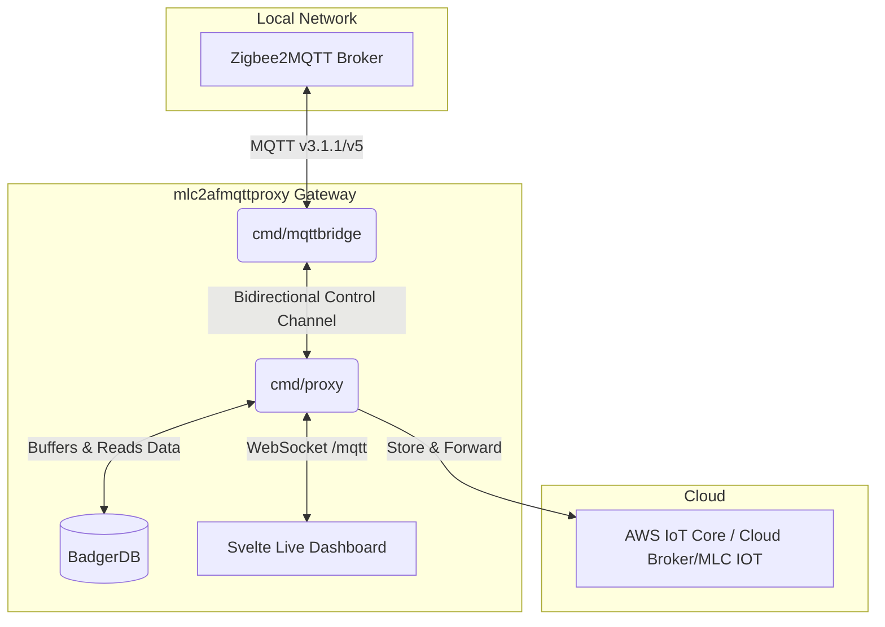

# MLC2AF MQTT Store & Forward Proxy

[🇩🇪 Auf Deutsch lesen](README.md)
An edge proxy for IoT sensors (e.g., Zigbee2MQTT) that ensures lossless telemetry transmission to the cloud on unreliable connections (e.g., edge gateways with cellular/poor WiFi).

## What does the proxy do?
The proxy starts a local MQTT broker (Mochi) to which Zigbee2MQTT (or other local sensors) send their data. The proxy intercepts this data and writes it locally and extremely fast to disk (BadgerDB). An independent background worker then attempts to forward this data to the cloud.

> [!IMPORTANT]
> **The main advantage of this solution:** No data can be lost, even in the event of a complete internet or network outage. The only requirement is that this proxy and the data source (e.g., Zigbee2MQTT) run on the same server, which is protected by a UPS (Uninterruptible Power Supply). Since the proxy is extremely resource-efficient, a very small computer like a Raspberry Pi is completely sufficient for this. When the internet connection is restored, all cached data is transmitted to the cloud with the correct historical timestamps.

### Core Features
*   **Efficiency:** Uses BadgerDB for extremely fast, local caching.
*   **Resilience:** The proxy steps in when the master broker is offline.
*   **Live Dashboard:** Integrated, reactive MQTT Tree Explorer (Websocket-based, Svelte) on port `8097`.
*   **Mochi-MQTT Broker:** Embedded, resource-efficient MQTT broker for local devices.
*   **Protocol Support:** Full support for MQTT v3.1.1, MQTT v4, and MQTT v5.
  * **Outbound (Upstream & Bridge)**: Intentionally uses **MQTT v3.1.1** for maximum compatibility, as the majority of cloud brokers (like AWS IoT Core) prefer this standard for data ingestion.
* **Offline Catch-Up (Time-Travel)**: The exact historical timestamps (`ts`) of the sensor events are injected during transmission. This prevents skewed graphs when the internet returns.
* **Two Upstream Modes**: 
  * `http`: Maps flat Zigbee JSON directly to the structured MLC Sensor Monitor format (`POST /api/v1/ingest`).
  * `mqtt`: Forwards MQTT messages with `QoS 1` to an upstream cloud broker. Since MQTT v3.1.1 does not support timestamp metadata by default, the proxy offers three configurable `timestamp_mode` options:
    * `none`: Default behavior (No timestamp).
    * `json_inject`: Unpacks JSON payloads and injects the timestamp as a `ts` attribute.
    * `v5_property`: Uses MQTT v5 and sends the timestamp as a "User Property" header.
  * **Topic Rewrite:** Optionally, an incoming topic prefix (`match_prefix`) can be replaced with another (`replace_with`) during MQTT forwarding (e.g., from `zigbee2mqtt/` to `/v1/bridgedataxxx/`).
* **Health & Diagnostics**: Built-in web dashboard (Port `8097`) displays the live buffer level and status information (`/api/v1/health` returns the version).
* **Failsafe**: Out-of-the-box Systemd deployment for autostart after power failures.

## Quickstart
The project uses [Task](https://taskfile.dev/) for automated builds.

1. **Resolve Dependencies:** `task setup`
2. **Compile:** `task build`
3. **Run Locally:** `task run`
4. **Install as Background Service (Linux):** `task install-service` (requires sudo)

## Architecture & Tools

This project consists of several components working closely together:



### 1. The Live Dashboard (UI)
The proxy offers an integrated web dashboard (Svelte) on port `8097`. It displays the buffer status and provides a reactive **Live MQTT Tree Explorer**.


### 2. CLI Tools
In addition to the proxy, the project includes useful utilities in `cmd/`.

#### MQTT Bridge
A simple CLI tool (`bin/mqttbridge`) to forward all messages from a "master" MQTT broker (e.g., a local Zigbee2MQTT broker) to a "slave" broker (e.g., this proxy) for testing purposes or local redirection:
```bash
./bin/mqttbridge --master tcp://localhost:1883 --slave tcp://localhost:1884 --topic "#"
```
Use `./bin/mqttbridge --help` for more options.

> [!NOTE]
> **Limitation:** Forwarding is currently **strictly unidirectional** (Master -> Slave). It is therefore _not_ possible to work bidirectionally with this test tool, e.g., to turn on a light on the master broker via the slave broker.

## Configuration
All parameters and architecture diagrams can be found in the [Configuration Documentation](docs/configuration.md).

## Versioning
The version of the proxy is automatically derived from your Git tags during the build (`task build`) and compiled into the binary. It can be queried at any time via the `GET /api/v1/health` endpoint.

## License
This project is licensed under the **GNU General Public License v3.0 (GPLv3)**.
Copyright (C) 2026 Michael Lechner

This license ensures the requirement for attribution of the original author. Anyone who modifies or redistributes this project must retain the copyright notice and make their changes available as Open Source under the same license terms (GPLv3). See the `LICENSE` file for the full license terms.
