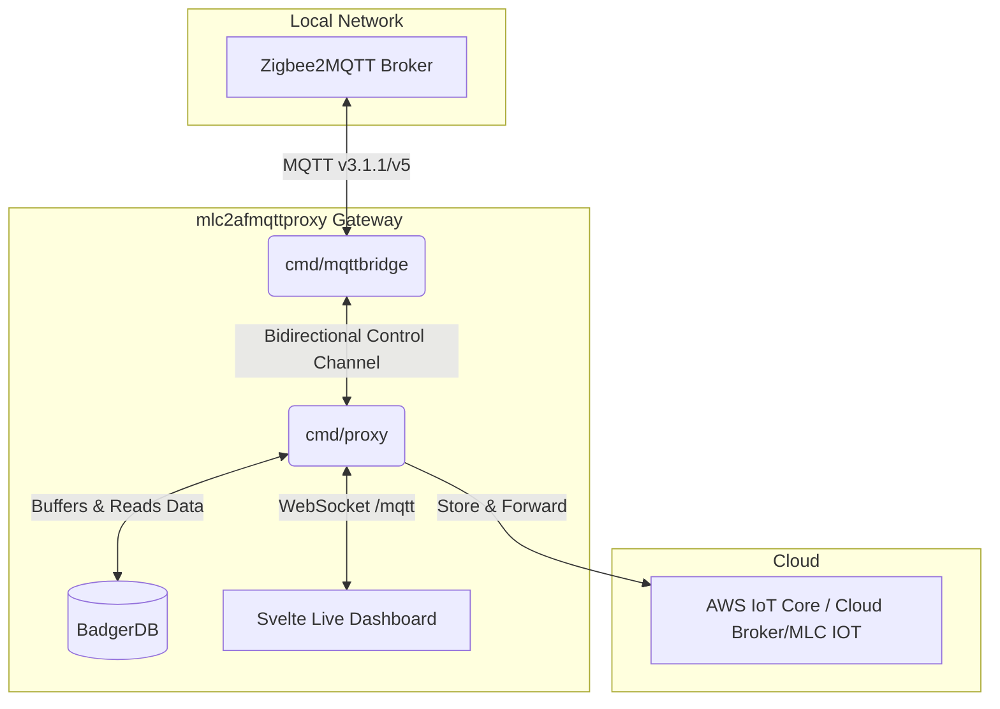
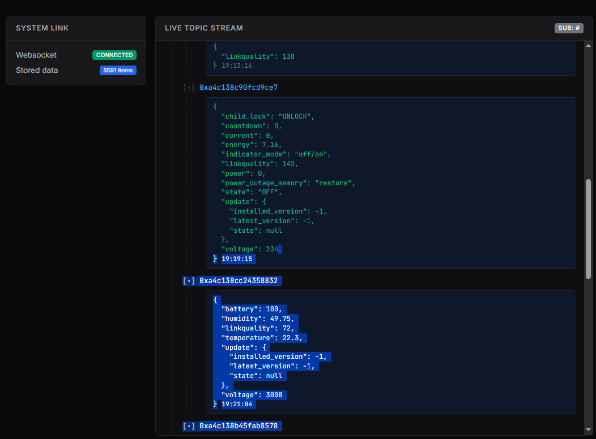

# MLC Edge Proxy

> **[mlcgo.eu](https://mlcgo.eu)** — tools, libraries and manuals


[🇩🇪 Lies dies auf Deutsch](README.md)
An Edge Proxy for IoT sensors (e.g. Zigbee2MQTT) that ensures lossless telemetry transmission to the cloud over unreliable connections (e.g. Edge Gateways with cellular/poor WiFi).

## What does the proxy do?
The **MLC Edge Proxy** is a lightweight, Go-based local MQTT broker (built on Mochi-MQTT) that implements a "store-and-forward" architecture. It is specifically designed to run on edge devices (e.g., a local Raspberry Pi hosting Zigbee2MQTT). The proxy intercepts this data and writes it locally and extremely fast to a local database on disk. An independent background worker then attempts to forward this data to the cloud.

### Why use Zigbee sensors in the first place?
Especially in industrial IoT or edge environments, Zigbee sensors offer enormous advantages:
1. **Low Power & Battery Operated:** Zigbee devices consume extremely little power. A small sensor (e.g., for temperature or humidity) can often run for **several years** on a single coin cell battery without needing a replacement.
2. **Mesh Network:** Zigbee builds a self-healing mesh network. Every mains-powered Zigbee device (e.g., a smart plug or repeater) automatically forwards the signal of other sensors, achieving huge ranges and high reliability even in complex buildings.
3. **Cost & Variety:** There is a massive selection of extremely affordable and reliable sensors from various manufacturers, all working seamlessly together cross-vendor thanks to *Zigbee2MQTT*.

> [!IMPORTANT]
> **The main advantage of this solution:** No data can be lost, even during a complete internet or network outage. The only requirement is that this proxy and the data source (e.g. Zigbee2MQTT) run on the same server, protected by a UPS (Uninterruptible Power Supply). Since the proxy is extremely resource-efficient, a very small computer like a Raspberry Pi is completely sufficient. Once the internet returns, all cached data is transmitted to the cloud with the correct historical timestamps.

## Why use this Proxy?

Whether you are forwarding IoT data centrally to the cloud or integrating it into a local Smart Home system – this proxy solves several core architectural problems at the network edge:

1. **Zero Data Loss (Store & Forward):**
   Internet or home WiFi goes down? No problem. The proxy buffers all sensor data locally in a blazing-fast database. Once the connection is restored, all data is submitted seamlessly without missing a beat.
2. **Bandwidth Reduction & Cloud Relief (Edge Computing):**
   Many sensors (e.g., smart meters) send exactly the same value every second. The *Smart JSON Deduplication* discards redundant data locally at the edge before it even hits the network. This not only saves gigabytes of mobile data volume but also significantly relieves your backend databases.
3. **Perfect for Home Assistant & Cloud:**
   Thanks to the Time-Travel feature (`timestamp_mode`), exact historical timestamps are injected during transmission. Backend systems or *Home Assistant* instances can thus record the sensor value at its true, original time, instead of logging thousands of values with a fake "now" timestamp after a long offline period.
4. **Protection against "Poison Messages":**
   Cloud brokers (and occasionally local brokers) sometimes reject invalid topics or payloads. Instead of dying in an infinite reconnect loop, the proxy detects this using MQTT 5 Reason Codes and preemptively purges the defective message from the queue so the rest of the data stream can continue to flow unhindered.

### Core Features
*   **Efficiency:** Uses an embedded database for extremely fast, local caching.
*   **Resilience:** The proxy steps in when the master broker is offline.
*   **Live Dashboard:** Integrated, reactive MQTT Tree Explorer (Websocket-based, Svelte) on port `8097`.
*   **Mochi-MQTT Broker:** Embedded, resource-efficient MQTT Broker for local devices.
*   **Protocol Support:** Full support for MQTT v3.1.1, MQTT v4, and **MQTT v5**.
  * **Outgoing (Upstream & Bridge)**: Uses either MQTT v3.1.1 for maximum compatibility, or natively uses **MQTT v5** to support modern features like User Properties.
* **Offline Catch-Up (Time-Travel)**: The exact historical timestamps (`ts`) of sensor events are submitted retrospectively. This prevents distorted graphs when the internet connection is restored.
* **Smart JSON Deduplication (Debouncing):** Prevents "nervous" sensors from flooding the network. Filters identical payloads within a configurable time window. Supports ignore lists (`deduplicate_ignore_keys`) to safely skip dynamic keys (like `last_seen`, `linkquality`) during byte comparison.
* **Poison Message Protection:** The background worker actively detects "poison" messages (e.g., publish attempts on wildcard topics like `+/#` or server `Reason Codes != 0`) and safely purges them from the local database. This effectively prevents head-of-line blocking and infinite reconnect loops.
* **Topic Aliases (MQTT 5):** Drastically reduces bandwidth consumption by replacing long topic strings (e.g., `zigbee2mqtt/0xf074bffffe91bd75`) with a simple integer alias after the first transmission. The proxy automatically detects upstream server restarts and safely resynchronizes aliases.
* **Two Upstream Modes**: 
  * `http`: Maps flat Zigbee JSON directly to the structured MLC Sensor Monitor format (`POST /api/v1/ingest`).
  * `mqtt`: Forwards MQTT messages with `QoS 1` to an upstream cloud broker. Since MQTT v3.1.1 does not support timestamp metadata by default, the proxy offers three configurable `timestamp_mode` options:
    * `none`: Default behavior (No timestamp).
    * `json_inject`: Unpacks JSON payloads and injects the timestamp (Unix ms) as the `_ts` attribute by default ("inject if absent" - existing fields are never overwritten!).
    * `v5_property`: Uses **MQTT v5** to inject the timestamp cleanly and highly efficiently as a "User Property" (`ts`) in the MQTT header. The JSON payload remains 100% untouched.
  
  > [!TIP]
  > **Note on Timestamps & Zigbee2MQTT:** If you are not using our own MLC backend, you should enable the `last_seen` option (as `epoch`) in Zigbee2MQTT. You can then set `timestamp_field: "last_seen"` in the proxy configuration. The proxy will act as a clean polyfill and only insert its reception time if Zigbee2MQTT hasn't provided a value yet.

  * **Topic Rewrite:** Optionally, an incoming topic prefix (`match_prefix`) can be replaced with another (`replace_with`) during MQTT forwarding (e.g., from `zigbee2mqtt/` to `/v1/bridgedataxxx/`).
* **Downstream Routing (Cloud → Local):** Messages from the upstream broker can be forwarded to local MQTT clients (e.g., to control actuators from the cloud). Loop detection via `origin` property prevents infinite loops. See `mqtt.downstream_config` in the configuration.
* **Self-monitoring & remote control (optional, on by default):** The proxy registers with the MLC Sensor Monitor as a service (`svc-edgeproxy`) via heartbeat and is **remotely controllable** (pause/resume/restart/stop). If it goes down, the monitor raises an event automatically — so the Zigbee-critical edge path is fully monitored. Deliberately **loosely coupled** (no code import, plain HTTP+MQTT) and disableable via `monitor.enabled: false`; the proxy keeps running without the monitor. `pause`/`drain` keep incoming data safely buffered (no loss). See the `monitor:` section in `config.yaml`.
* **Health & Diagnostics**: Built-in web dashboard (Port `8097`) displays the live buffer level and status information (`/api/v1/health` returns the version).
* **Fail-Safe**: Out-of-the-box systemd deployment for autostart after power failures.
* **Best Practice Setup**: For a detailed overview of the optimal, fail-safe hardware setup, see [Best Setup & Integration (German)](docs/best_setup.md).

## Quickstart
The project uses [Task](https://taskfile.dev/) for automated builds.

1. **Resolve Dependencies:** `task setup`
2. **Compile:** `task build`
3. **Run Locally:** `task run`
4. **Install as Background Service (Linux):** `task install-service` (requires sudo)

## Architecture & Tools

This project consists of several components working closely together:



### 1. The Live Dashboard (UI)
The proxy offers an integrated web dashboard (Svelte) on port `8097`. It displays the buffer status and provides a reactive **Live MQTT Tree Explorer**.



### 2. CLI Tools
In addition to the proxy, the project includes useful utilities in `cmd/`.

#### MQTT Bridge
A simple CLI tool (`bin/mqttbridge`) to forward all messages from a "master" MQTT broker (e.g., a local Zigbee2MQTT broker) to a "slave" broker (e.g., this proxy) for testing purposes or local redirection:
```bash
./bin/mqttbridge --master tcp://localhost:1883 --slave tcp://localhost:1884 --topic "#"
```

**Bidirectional Mode:**
By appending the `--bidi` flag, the tool operates bidirectionally (also routing data from the slave back to the master). It utilizes smart loop detection to effectively prevent endless echo loops.
```bash
./bin/mqttbridge --master tcp://localhost:1883 --slave tcp://localhost:1884 --topic "#" --bidi
```
Use `./bin/mqttbridge --help` for more options.

## Configuration
All parameters and architecture diagrams can be found in the [Configuration Documentation](docs/configuration.md).

## Versioning
The version of the proxy is automatically derived from your Git tags during the build (`task build`) and compiled into the binary. It can be queried at any time via the `GET /api/v1/health` endpoint.

## License
This project is licensed under the **GNU General Public License v3.0 (GPLv3)**.
Copyright (C) 2026 Michael Lechner

This license ensures the mandatory attribution of the original author. Anyone who modifies or redistributes this project must retain the copyright notice and make their modifications available as open source under the same license terms (GPLv3). See the `LICENSE` file for the full license terms.

## Changelog
All release notes and changes can be found in the [CHANGELOG_en.md](CHANGELOG_en.md).
