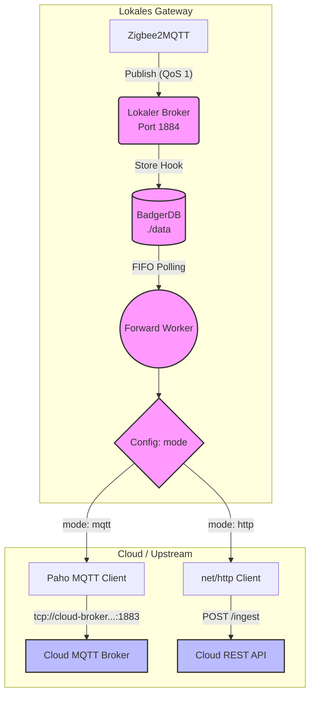

# Konfiguration (`config.yaml`)

[🇬🇧 Read this in English](configuration_en.md)
Der Proxy wird vollständig über eine zentrale `config.yaml` Datei gesteuert. Diese Datei muss im selben Verzeichnis wie das `proxy` Binary liegen.

## Konfigurations-Parameter

```yaml
# Die Betriebsart des Upstreams.
# Zulässige Werte: "http" oder "mqtt"
mode: "http"

# Hinweis zum MQTT-Modus & Zeitstempel:
# Da wir bei Store & Forward Offline-Daten nachreichen, ist der Zeitstempel wichtig.
# Die Option mqtt.timestamp_mode steuert das Verhalten:
# - "none": Standard MQTT v3.1.1, Zeitstempel wird ignoriert.
# - "json_inject": (Empfohlen) Entpackt den Payload (sofern JSON), fügt "ts" als Unix-Timestamp (ms) ein und packt ihn neu.
# - "v5_property": Sendet die Nachricht via MQTT v5 und übergibt den Zeitstempel (RFC3339) als "User Property" (ts).

server:
  # (Optional) Die IP-Adresse, an die der Webserver gebunden werden soll (Standard: "0.0.0.0" für alle Interfaces)
  host: "0.0.0.0"
  # Der Port für das Diagnostik-Web-Dashboard und die Health-API
  port: 8097
  # (Optional) Pfad-Präfix für die Diagnose-REST-API (Standard: "/api/v1")
  api_prefix: "/api/v1"

storage:
  # Pfad, in dem die BadgerDB ihre Daten ablegt (Store & Forward Puffer)
  path: "./data"

mqtt:
  # Der lokale Port, auf dem der eingebettete Mochi-Broker für Zigbee2MQTT lauscht
  local_port: 1884
  # Upstream-Einstellungen (nur relevant wenn mode: "mqtt")
  upstream: "tcp://cloud-broker.example.com:1883"
  username: "user"
  password: "password"
  # Wie Zeitstempel an den MQTT Upstream gesendet werden (none, json_inject, v5_property)
  timestamp_mode: "json_inject"
  # Name des injizierten Zeitstempel-Feldes im JSON (Standard: "_ts").
  # Es wird "inject if absent" genutzt, d.h. wenn dieses Feld schon existiert, bleibt es unangetastet!
  timestamp_field: "_ts"
  
  # Optionale Rewrite-Policy für das Base-Topic (z.B. umleiten auf einen Namespace)
  topic_rewrite:
    match_prefix: "zigbee2mqtt/"
    replace_with: "/v1/bridgedataxxx/"

http:
  # Upstream-Einstellungen (nur relevant wenn mode: "http")
  endpoint: "https://api.example.com/ingest"
  # Optional: Wird als "Authorization: Bearer <token>" Header mitgesendet
  token: "my-secret-token"

worker:
  # (Optional) Das Intervall für den Hintergrund-Worker in Millisekunden (Standard: 100)
  interval_ms: 100
  # (Optional) Maximale Anzahl von Nachrichten, die in einem Durchlauf (Batch) gesendet werden (Standard: 100)
  max_batch_size: 50
  # (Optional) Künstliche Verzögerung in Millisekunden zwischen Nachrichten innerhalb eines Batches (Standard: 0)
  batch_delay_ms: 10
  # (Optional) Minimaler Backoff bei Fehlern oder Verbindungsunterbrechungen in Sekunden (Standard: 1)
  retry_min_s: 1
  # (Optional) Maximaler Backoff bei Fehlern oder Verbindungsunterbrechungen in Sekunden (Standard: 60)
  retry_max_s: 60
```

## Architektur-Diagramm nach Betriebsart

Die Einstellung `mode` entscheidet darüber, über welchen Weg der Worker die Daten an die Cloud überträgt. Der lokale Datenfluss (Zigbee2MQTT -> Mochi -> BadgerDB) bleibt dabei immer identisch.


