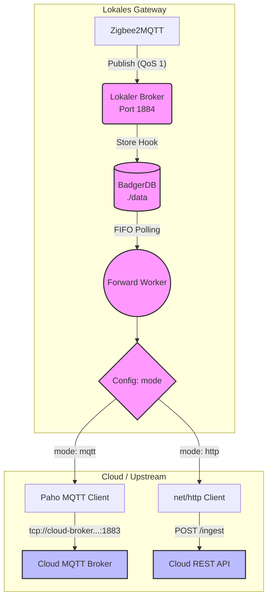

# Konfiguration (`config.yaml`)

Der Proxy wird vollständig über eine zentrale `config.yaml` Datei gesteuert. Diese Datei muss im selben Verzeichnis wie das `proxy` Binary liegen.

## Konfigurations-Parameter

```yaml
# Die Betriebsart des Upstreams.
# Zulässige Werte: "http" oder "mqtt"
mode: "http"

server:
  # Der Port für das Diagnostik-Web-Dashboard und die Health-API
  port: 8097

storage:
  # Pfad, in dem die BadgerDB ihre Daten ablegt (Store & Forward Puffer)
  path: "./data"

mqtt:
  # Der lokale Port, auf dem der eingebettete Mochi-Broker für Zigbee2MQTT lauscht
  local_port: 1884
  # Upstream-Einstellungen (nur relevant wenn mode: "mqtt")
  upstream: "tcp://cloud-broker.example.com:1883"
  username: "user"
  password: "password"

http:
  # Upstream-Einstellungen (nur relevant wenn mode: "http")
  endpoint: "https://api.example.com/ingest"
  # Optional: Wird als "Authorization: Bearer <token>" Header mitgesendet
  token: "my-secret-token"
```

## Architektur-Diagramm nach Betriebsart

Die Einstellung `mode` entscheidet darüber, über welchen Weg der Worker die Daten an die Cloud überträgt. Der lokale Datenfluss (Zigbee2MQTT -> Mochi -> BadgerDB) bleibt dabei immer identisch.


