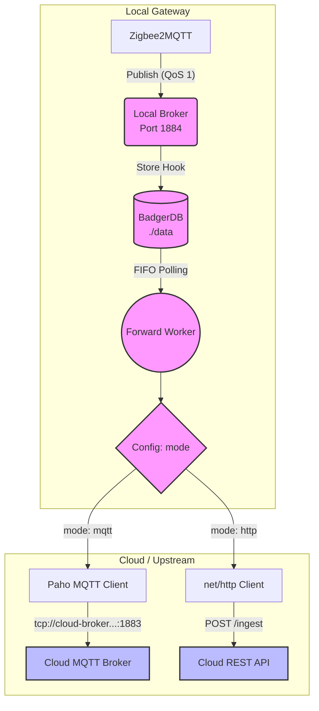

# Configuration (`config.yaml`)

[🇩🇪 Auf Deutsch lesen](configuration.md)

The proxy is completely controlled via a central `config.yaml` file. This file must be located in the same directory as the `proxy` binary.

## Configuration Parameters

```yaml
# The operation mode of the upstream.
# Allowed values: "http" or "mqtt"
mode: "http"

# Note on MQTT mode & timestamps:
# Since we provide offline data later with Store & Forward, the timestamp is important.
# The option mqtt.timestamp_mode controls the behavior:
# - "none": Standard MQTT v3.1.1, timestamp is ignored.
# - "json_inject": (Recommended) Unpacks the payload (if JSON), inserts the timestamp as a Unix timestamp (ms) and repacks it.
# - "v5_property": Sends the message via MQTT v5 and passes the timestamp (RFC3339) as a "User Property" header.

server:
  # The port for the diagnostic web dashboard and the health API
  port: 8097

storage:
  # Path where BadgerDB stores its data (Store & Forward buffer)
  path: "./data"

mqtt:
  # The local port on which the embedded Mochi broker listens for Zigbee2MQTT
  local_port: 1884
  # Upstream settings (only relevant if mode: "mqtt")
  upstream: "tcp://cloud-broker.example.com:1883"
  username: "user"
  password: "password"
  # How timestamps are sent to the MQTT upstream (none, json_inject, v5_property)
  timestamp_mode: "json_inject"
  # Name of the injected timestamp field in the JSON (Default: "_ts").
  # It uses "inject if absent", meaning if this field already exists, it remains untouched!
  timestamp_field: "_ts"
  
  # Optional rewrite policy for the base topic (e.g., to route to a namespace)
  topic_rewrite:
    match_prefix: "zigbee2mqtt/"
    replace_with: "/v1/bridgedataxxx/"

http:
  # Upstream settings (only relevant if mode: "http")
  endpoint: "https://api.example.com/ingest"
  # Optional: Will be sent as "Authorization: Bearer <token>" header
  token: "my-secret-token"
```

## Architecture Diagram by Operation Mode

The `mode` setting determines which path the worker uses to transmit the data to the cloud. The local data flow (Zigbee2MQTT -> Mochi -> BadgerDB) always remains identical.


