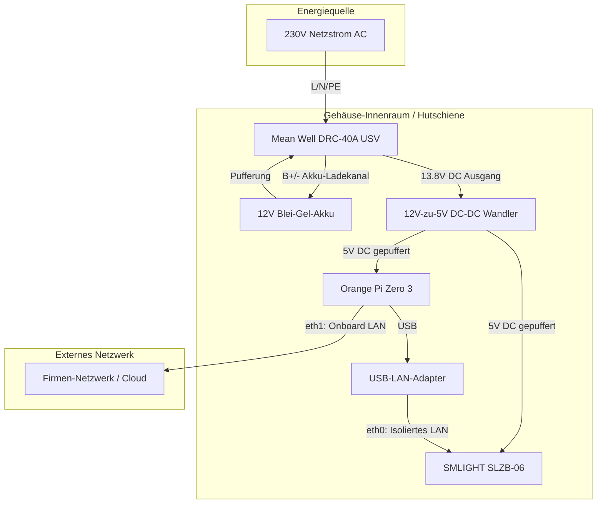
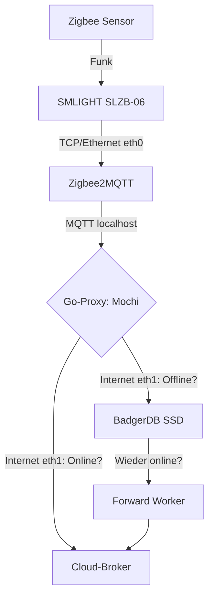
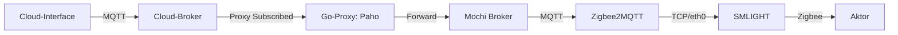

# Projektplan: Ausfallsicheres & Isoliertes Zigbee-IoT-Backend (Store & Forward)

Dieses Dokument ist der Masterplan für den Aufbau eines hochverfügbaren Zigbee-Gateways. Es kombiniert eine isolierte Netzwerk-Topologie mit einer robusten Go-Proxy-Logik zur lückenlosen Datenaufzeichnung.

## 📦 1. Die Stückliste (Hardware & Gehäuse)

| Komponente | Empfohlenes Modell | Funktion | Preis (ca.) |
| :--- | :--- | :--- | :--- |
| **Gehäuse** | Spelsberg TK PC 2015-10-tm | Robustes IP65 Wandgehäuse mit transparentem Deckel. | ~30 € |
| **Hutschiene** | DIN-Rail TS-35 (Länge: ca. 180mm) | Trägerschiene für alle internen Komponenten. | ~3 € |
| **Netzteil / USV** | Mean Well DRC-40A | 40W AC/DC Netzteil mit Akku-Ladekanal. | ~25 € |
| **Akkupack** | 12V Blei-Gel-Akku (2.3Ah - 7Ah) | Pufferbatterie (wartungsfrei, langlebig). | ~15 € |
| **DC-DC Wandler** | 12V-zu-5V Buck Converter (min. 4A) | Hutschienen-Gehäuse, wandelt USV-Spannung stabil auf 5V. | ~12 € |
| **Server** | Orange Pi Zero 3 (2GB RAM) | Lokales OS, Zigbee2MQTT, Speicher-Proxy. | ~30 € |
| **Halterung** | DIN-Rail-Clip (3D-Druck/Universal) | Fixiert Orange Pi auf der TS-35 Schiene. | ~5 € |
| **Zigbee-Gateway**| SMLIGHT SLZB-06 | Ethernet-Koordinator (inkl. DIN-Rail Halterung). | ~35 € |
| **LAN-Adapter** | USB 3.0 auf Gigabit (RTL8153) | Stellt die zweite LAN-Schnittstelle (eth1) bereit. | ~12 € |
| **Verschraubung** | 3x PG11 / M16 Kabelverschraubung | Staub- und feuchtigkeitsdichte Ausgänge. | ~4 € |
| **Zeit** | DS3231 RTC Modul (I2C) | Netzunabhängige Zeitstempel. | ~5 € |
| **Gesamt** | | | **~176 €** |

## ⚡ 2. Der Verdrahtungsplan (Wiring Diagram)

### Technische Details zur Verkabelung
*   **5V-Versorgung**: Der Ausgang des DC-DC-Wandlers wird gesplittet. Er versorgt den Orange Pi direkt über die GPIO-Pins (5V/GND) und den SMLIGHT über seinen USB-C-Eingang.
*   **USV-Logik**: Das Mean Well DRC-40A schaltet bei Stromausfall unterbrechungsfrei (0 ms) auf den Akku um. Der DC-DC-Wandler stabilisiert die fallende Akkuspannung dauerhaft auf 5,00V.
*   **Tiefentladeschutz**: Das DRC-40A trennt den Akku automatisch bei ca. 10,5V (Battery Low Cut-off), um Zellschäden zu vermeiden.
*   **Signal-Führung**: Bei Montage außerhalb geschirmter Räume führt das LAN-Kabel (`eth1`) durch die Wand. Bei Montage innerhalb des Raums wird die Antenne des SMLIGHT via SMA-Verlängerung nach außen geführt.

## 📊 Datenfluss-Diagramme

### Upstream (Sensor ➡️ Cloud)

### Downstream (Cloud ➡️ Aktor)

## 🚀 Phasenplan (Implementierung)

### 🛠️ Phase 1: Hardware & Industrial Assembly
- [ ] RTC-Modul (DS3231) aktivieren und USV-Monitoring via GPIO (Netz-Status-Kontakt des DRC-40A) einrichten.
- [ ] Physischer Aufbau auf Hutschiene im IP65 Gehäuse.
- [ ] SSD-Mounting (`/var/lib/proxy_data`) mit SSD-optimierten Filesystem-Parametern.

### 📝 Phase 2: Gateway & Isoliertes Netzwerk
- [ ] `eth0` auf `192.168.99.1` fixieren; SMLIGHT auf `192.168.99.2`.
- [ ] Zigbee2MQTT mit `timestamp_format: "ISO_8601"` und `qos: 1` konfigurieren.

### 💻 Phase 3: Entwicklung & Start Go-Proxy
- [x] **Basis-Setup**: Go Module, Konfiguration, Mochi Broker, BadgerDB, Gin Webserver initialisiert.
- [ ] **Proxy-Features**: Forwarder Interface (Unterstützung für MQTT & HTTP Ingest), BadgerDB Puffer, Retention-Policy (FIFO), Health-API (`/health`).
- [ ] **Diagnostik-UI**: Integriertes Bootstrap 5 Dashboard zur Anzeige von Systemzustand und gepufferten Daten.
- [ ] **Deployment**: Systemd-Unit mit Abhängigkeiten (`After=network.target`).

### 🧪 Phase 5: Härtungstests
- [ ] **Test 1**: Netzstecker ziehen -> 0ms USV-Umschaltung prüfen.
- [ ] **Test 2**: Internet-Kabel ziehen -> Lokale Pufferung verifizieren.
- [ ] **Test 3**: Reconnect -> Chronologischer Cloud-Upload und Puffer-Leerung.

## 🛡️ Betriebs- & Sicherheitskonzept
*   **Überlaufschutz**: Automatisches Pruning bei > 90% SSD-Füllstand.
*   **Identität**: mTLS-Zertifikate pro Proxy-UUID.
*   **Auditing**: Lokales Logbuch über alle Offline-Phasen und Forward-Zyklen.
